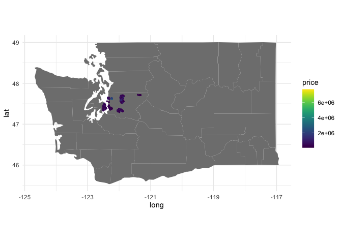
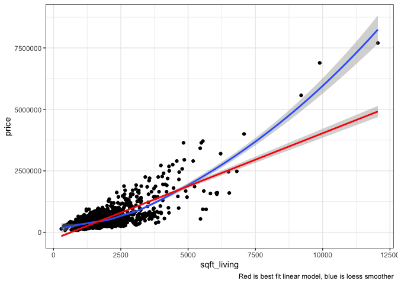
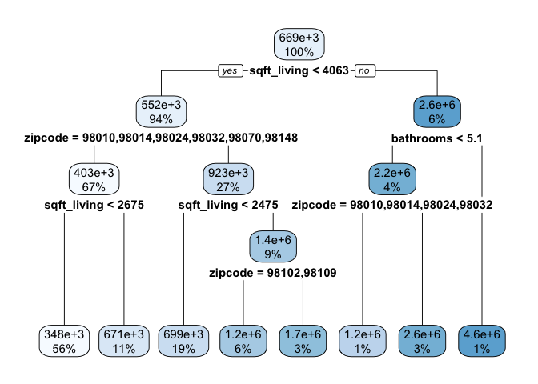
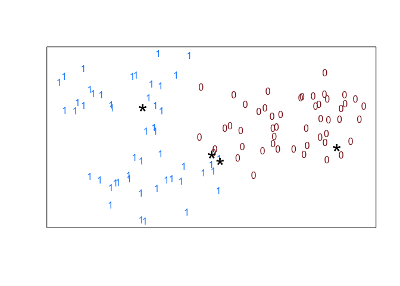
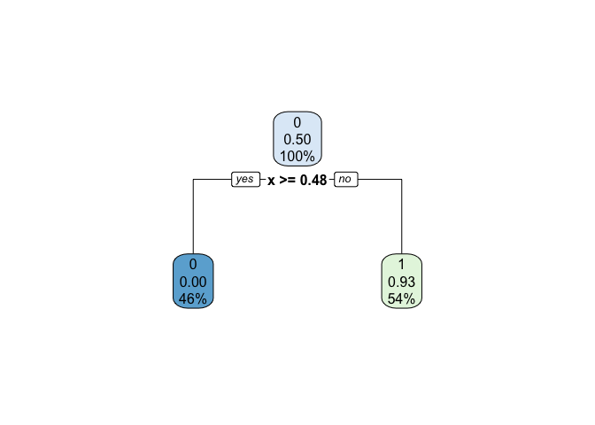
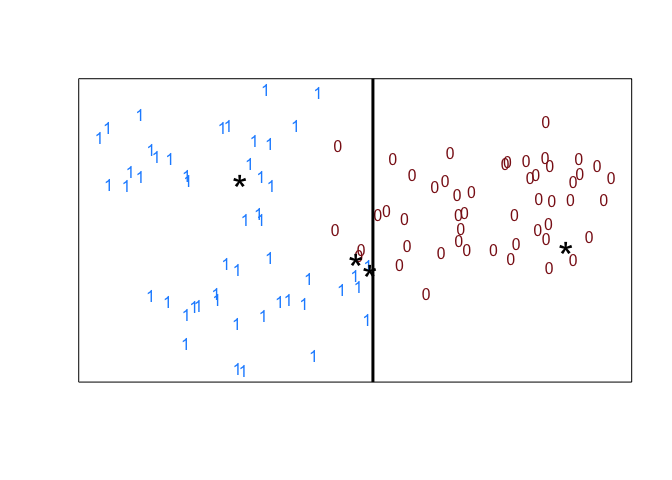

# Predictive Modeling


## Predictive Modeling / Statistical Learning

Here are a few questions to consider:

- What do predictive modeling and statistical learning mean to you?
- What about terms like: artificial intelligence, data science, data
  mining, data analytics, machine learning, predictive analytics,
  predictive modeling, statistical learning are these different from
  statistics?

## Statistical Learning Definition

> Statistical learning refers to a set of tools for modeling and
> understanding complex datasets. It is a recently developed area in
> statistics and blends with parallel developments in computer science
> and, in particular, machine learning. The field encompasses many
> methods such as the lasso and sparse regression, classification and
> regression trees, and boosting and support vector machines.

Courtesy of *An Introduction to Statistical Learning: with Applications
in R*, by Gareth James, Daniela Witten, Trevor Hastie, and Robert
Tibshirani. Note: a free e-version of this textbook can be obtain for
free through the MSU Library.

## Predictive Modeling Overview

Recall the Seattle housing data set, how would you:

- Build a model to predict housing prices in King County
- Determine if your model was good or useful?

``` r
seattle <- read_csv('http://www.math.montana.edu/ahoegh/teaching/stat408/datasets/SeattleHousing.csv') |>
  mutate(zipcode = factor(zipcode),
         house_id = 1:n())
```

    Rows: 869 Columns: 14
    ── Column specification ────────────────────────────────────────────────────────
    Delimiter: ","
    dbl (14): price, bedrooms, bathrooms, sqft_living, sqft_lot, floors, waterfr...

    ℹ Use `spec()` to retrieve the full column specification for this data.
    ℹ Specify the column types or set `show_col_types = FALSE` to quiet this message.

``` r
glimpse(seattle)
```

    Rows: 869
    Columns: 15
    $ price         <dbl> 1350000, 228000, 289000, 720000, 247500, 850830, 890000,…
    $ bedrooms      <dbl> 3, 3, 3, 4, 3, 3, 4, 5, 3, 2, 3, 3, 1, 4, 4, 1, 2, 4, 5,…
    $ bathrooms     <dbl> 2.50, 1.00, 1.75, 2.50, 1.75, 2.50, 1.00, 2.00, 2.50, 1.…
    $ sqft_living   <dbl> 2753, 1190, 1260, 3450, 1960, 2070, 2550, 2260, 1910, 10…
    $ sqft_lot      <dbl> 65005, 9199, 8400, 39683, 15681, 13241, 4000, 12500, 662…
    $ floors        <dbl> 1.0, 1.0, 1.0, 2.0, 1.0, 1.5, 2.0, 1.0, 2.0, 1.0, 1.0, 1…
    $ waterfront    <dbl> 1, 0, 0, 0, 0, 0, 0, 0, 0, 0, 0, 0, 1, 0, 0, 0, 0, 0, 0,…
    $ sqft_above    <dbl> 2165, 1190, 1260, 3450, 1960, 1270, 2370, 1130, 1910, 10…
    $ sqft_basement <dbl> 588, 0, 0, 0, 0, 800, 180, 1130, 0, 0, 580, 570, 0, 0, 0…
    $ zipcode       <fct> 98070, 98148, 98148, 98010, 98032, 98102, 98109, 98032, …
    $ lat           <dbl> 47.4041, 47.4258, 47.4366, 47.3420, 47.3576, 47.6415, 47…
    $ long          <dbl> -122.451, -122.322, -122.335, -122.025, -122.277, -122.3…
    $ yr_sold       <dbl> 2015, 2014, 2014, 2015, 2015, 2014, 2014, 2014, 2015, 20…
    $ mn_sold       <dbl> 3, 9, 8, 3, 3, 6, 6, 10, 1, 11, 4, 9, 10, 9, 10, 6, 7, 6…
    $ house_id      <int> 1, 2, 3, 4, 5, 6, 7, 8, 9, 10, 11, 12, 13, 14, 15, 16, 1…

## Loss functions

A loss function is a principled way to compare a set of predictive
models.

Squared Error: $$ (Price_{pred} - Price_{actual}) ^ 2$$

Zero - One Loss (binary setting): $$f(x)=
\begin{cases}
    1,& \text{if } y_{pred} \neq y_{actual}\\
    0,              & y_{pred} = y_{actual}
\end{cases}$$

## Model Evaluation

Suppose we fit a model using all of the Seattle housing data, can that
model be used to predict prices for homes in that data set?



We cannot assess the predictive performance by fitting a model to data
and then evaluating the model using the same data.

## Test / Training and Cross-Validation

There are two common options to give valid estimates of model
performance:

- **Training / Validation / Test approach**. Generally 70% of the data
  is used to fit the model (training) and the other 30% is held out for
  validation and testing.

- **Cross-Validation**. Cross validation breaks your data into *k*
  groups, or folds. Then a model is fit on the data on the *k-1* groups
  and then used to make predictions on data in the held out \*k$^{th}$
  group. This process continues until all groups have been held out
  once.

## Constructing a test and training set

``` r
set.seed(11112024)
num_houses <- nrow(seattle)

# select 70 % of houses for training set
train_ids <- sample(1:num_houses, size=round(num_houses*.7))
train_set <- seattle |> 
  filter(house_id %in% train_ids)

# select remaining 30 % of houses for test set
test_set <- seattle |>
  filter(! house_id %in% train_ids)
```

## Linear Regression

``` r
lm1 <- lm(price ~ bedrooms + bathrooms + sqft_living + zipcode + waterfront, data=train_set)
summary(lm1)
```


    Call:
    lm(formula = price ~ bedrooms + bathrooms + sqft_living + zipcode + 
        waterfront, data = train_set)

    Residuals:
         Min       1Q   Median       3Q      Max 
    -1223732  -142781    11127   135486  2893788 

    Coefficients:
                   Estimate Std. Error t value Pr(>|t|)    
    (Intercept)  -166444.73   57210.68  -2.909  0.00376 ** 
    bedrooms      -83789.82   16598.59  -5.048 5.94e-07 ***
    bathrooms     -20591.71   22421.71  -0.918  0.35879    
    sqft_living      427.93      18.79  22.778  < 2e-16 ***
    zipcode98014   22194.17   47774.14   0.465  0.64241    
    zipcode98024   54194.14   51564.04   1.051  0.29368    
    zipcode98032  -25395.03   47637.59  -0.533  0.59417    
    zipcode98039 1117168.05   59568.56  18.754  < 2e-16 ***
    zipcode98070   69687.86   49537.44   1.407  0.16002    
    zipcode98102  483596.28   50475.88   9.581  < 2e-16 ***
    zipcode98109  490837.06   47218.70  10.395  < 2e-16 ***
    zipcode98148   65418.33   57915.68   1.130  0.25912    
    waterfront    184206.83   73350.78   2.511  0.01229 *  
    ---
    Signif. codes:  0 '***' 0.001 '**' 0.01 '*' 0.05 '.' 0.1 ' ' 1

    Residual standard error: 290900 on 595 degrees of freedom
    Multiple R-squared:  0.8327,    Adjusted R-squared:  0.8293 
    F-statistic: 246.7 on 12 and 595 DF,  p-value: < 2.2e-16

``` r
mad_lm <- mean(abs(test_set$price - predict(lm1,test_set)))
```

The mean absolute deviation in housing price predictions using the
linear model is \$163,457

## Polynomial Regression

``` r
seattle |>
  ggplot(aes(y = price, x = sqft_living)) +
  geom_point() +
  geom_smooth(method = 'loess', formula = 'y~x') +
  geom_smooth(method = 'lm', formula = 'y~x', color = 'red') +
  theme_bw() +
  labs(caption = 'Red is best fit linear model, blue is loess smoother')
```



Now include squared terms for square foot of living space too.

``` r
train_set <- train_set |>
  mutate(sqft_living2 = sqft_living^2)

test_set <- test_set |>
  mutate(sqft_living2 = sqft_living^2)

lm2 <- lm(price ~ bedrooms + bathrooms + sqft_living + sqft_living2 + 
             zipcode + waterfront, data=train_set)
summary(lm2)
```


    Call:
    lm(formula = price ~ bedrooms + bathrooms + sqft_living + sqft_living2 + 
        zipcode + waterfront, data = train_set)

    Residuals:
         Min       1Q   Median       3Q      Max 
    -1033026   -90773      478    79665  1203189 

    Coefficients:
                   Estimate Std. Error t value Pr(>|t|)    
    (Intercept)   1.805e+05  4.495e+04   4.016 6.67e-05 ***
    bedrooms     -1.801e+04  1.259e+04  -1.430 0.153104    
    bathrooms     6.671e+03  1.658e+04   0.402 0.687562    
    sqft_living   1.274e+01  2.317e+01   0.550 0.582691    
    sqft_living2  4.928e-02  2.204e-03  22.363  < 2e-16 ***
    zipcode98014  2.333e+04  3.523e+04   0.662 0.508119    
    zipcode98024  6.413e+04  3.803e+04   1.686 0.092270 .  
    zipcode98032 -8.296e+04  3.522e+04  -2.355 0.018830 *  
    zipcode98039  1.122e+06  4.393e+04  25.548  < 2e-16 ***
    zipcode98070  6.965e+04  3.653e+04   1.906 0.057072 .  
    zipcode98102  4.125e+05  3.736e+04  11.043  < 2e-16 ***
    zipcode98109  4.746e+05  3.483e+04  13.627  < 2e-16 ***
    zipcode98148 -1.627e+04  4.287e+04  -0.379 0.704486    
    waterfront    1.903e+05  5.409e+04   3.517 0.000469 ***
    ---
    Signif. codes:  0 '***' 0.001 '**' 0.01 '*' 0.05 '.' 0.1 ' ' 1

    Residual standard error: 214500 on 594 degrees of freedom
    Multiple R-squared:  0.9092,    Adjusted R-squared:  0.9072 
    F-statistic: 457.3 on 13 and 594 DF,  p-value: < 2.2e-16

``` r
mad_lm2 <- mean(abs(test_set$price - predict(lm2,test_set)))
```

Including this squared term lowers our predictive error from \$115,918.

## Decision Trees



``` r
mad_tree1 <- mean(abs(test_set$price - predict(tree1,test_set)))
```

Using this algorithm, our predictive error is about the same as the
first regression model \$162,466.

## Ensemble Methods - Random Forest

Ensemble methods combine a large set of predictive models into a single
framework. One example is a random forest - which combines a large
number of trees.

While these methods are very effective in a predictive setting, it is
often difficult to directly assess the impact of particular variables in
the model.

## Random Forest

One specific kind of ensemble method is known as a random forest, which
combines several decision trees.

``` r
rf1 <- randomForest(price~., data=train_set)

mad_rf <- mean(abs(test_set$price - predict(rf1,test_set)))
```

The prediction error for the random forest is substantially better than
the other models we have identified \$103,644.

## Classification Methods

Classification - Given New Points (\*) how do we classify them?



## Logistic Regression

``` r
labels <- (rep(c(1,0),each=50))
supervised <- as.data.frame(cbind(labels, combined))
colnames(supervised)[2:3] <- c('x','y')
logistic <- glm(labels ~ x + y, data = supervised, family='binomial')
summary(logistic)
```


    Call:
    glm(formula = labels ~ x + y, family = "binomial", data = supervised)

    Coefficients:
                Estimate Std. Error z value Pr(>|z|)  
    (Intercept)   23.898     11.813   2.023   0.0431 *
    x            -47.482     23.973  -1.981   0.0476 *
    y             -6.214      3.456  -1.798   0.0722 .
    ---
    Signif. codes:  0 '***' 0.001 '**' 0.01 '*' 0.05 '.' 0.1 ' ' 1

    (Dispersion parameter for binomial family taken to be 1)

        Null deviance: 138.629  on 99  degrees of freedom
    Residual deviance:  13.024  on 97  degrees of freedom
    AIC: 19.024

    Number of Fisher Scoring iterations: 10

|    x |    y | Prob\[Val = 1\] |
|-----:|-----:|----------------:|
| 0.20 | 0.70 |           1.000 |
| 0.45 | 0.35 |           0.588 |
| 0.48 | 0.30 |           0.319 |
| 0.90 | 0.40 |           0.000 |

## Decision Trees





``` r
kable(cbind(pred.points,
    round(predict(tree1,as.data.frame(pred.points))[,2],3)),
    col.names=c('x','y','Prob[Val = 1]'))
```

|    x |    y | Prob\[Val = 1\] |
|-----:|-----:|----------------:|
| 0.20 | 0.70 |           0.926 |
| 0.45 | 0.35 |           0.926 |
| 0.48 | 0.30 |           0.926 |
| 0.90 | 0.40 |           0.000 |

## Exercise - Prediction for Capital Bike Share

``` r
bikes <- read_csv('http://www.math.montana.edu/ahoegh/teaching/stat408/datasets/Bike.csv') |>
  mutate(bike_id = 1:n(),
         season = factor(season),
         holiday = factor(holiday),
         workingday = factor(workingday),
         weather = factor(weather))
```

    Rows: 10886 Columns: 12
    ── Column specification ────────────────────────────────────────────────────────
    Delimiter: ","
    dbl  (11): season, holiday, workingday, weather, temp, atemp, humidity, wind...
    dttm  (1): datetime

    ℹ Use `spec()` to retrieve the full column specification for this data.
    ℹ Specify the column types or set `show_col_types = FALSE` to quiet this message.

``` r
set.seed(11142024)
train_bike_ids <- sample(1:nrow(bikes), floor(.7 * nrow(bikes))) 
train_bike <- bikes |>
  filter(bike_id %in% train_bike_ids)

test_validation_ids <- (1:nrow(bikes))[!(1:nrow(bikes)) %in% train_bike_ids]
test_ids <- sample(test_validation_ids, round(length(test_validation_ids)/2))
test_bike <- bikes |>
  filter(bike_id %in% test_ids)

validation_bike <- bikes |>
  filter(!bike_id %in% c(train_bike_ids, test_ids))
```

Construct a few predictive models and compare your prediction error
(Mean absolute deviation) on count. You can use the validation set to
tune (or tinker with) your model.

``` r
lm_bikes <- lm(count ~ holiday + atemp + workingday, data=train_bike)
lm_mad <- mean(abs(test_bike$count - predict(lm_bikes,test_bike)))
```

A basic linear model has a prediction error of 127, so if you can
improve upon this.
